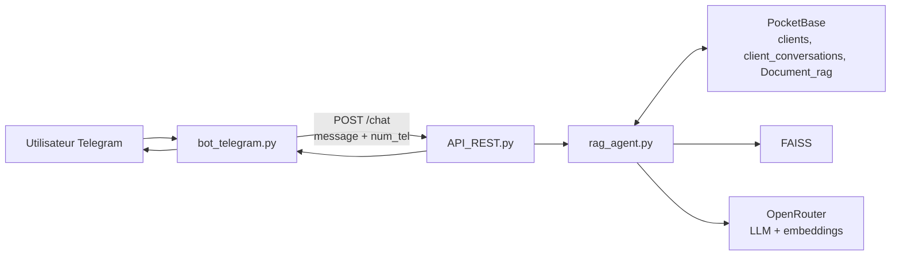

# Assistant RAG SISMA : Telegram, FastAPI et PocketBase

Cet assistant conversationnel répond aux questions des élèves et prospects de SISMA depuis Telegram. Il enrichit les réponses avec les documents de la collection PocketBase `Document_rag`, conserve un historique par utilisateur et utilise OpenRouter pour la génération et les embeddings.

## Architecture



Les composants principaux sont les suivants :

- `bot_telegram.py` reçoit les messages Telegram et appelle l'API locale.
- `API_REST.py` expose l'API FastAPI et initialise le retriever au démarrage.
- `rag_agent.py` télécharge les documents, construit FAISS, gère l'historique et appelle le LLM.
- `sys_prompt.txt` contient les instructions de comportement de l'assistant. Une fiche `system_prompt` de PocketBase peut le remplacer.
- `docs/FAQ.txt` fournit un exemple de source documentaire.

## API REST

L'API est disponible par défaut sur `http://127.0.0.1:8000`.

| Methode    | Route                  | Description                                     |
| ---------- | ---------------------- | ----------------------------------------------- |
| `GET`    | `/operational`       | Etat de l'API et disponibilite du retriever.    |
| `POST`   | `/chat`              | Envoie une question a l'agent.                  |
| `GET`    | `/history/{num_tel}` | Retourne l'historique associe a un utilisateur. |
| `DELETE` | `/history/{num_tel}` | Efface l'historique sans supprimer le client.   |

Exemple d'appel a `/chat` :

```http
POST /chat
Content-Type: application/json
```

```json
{
  "message": "Quelles sont les formations disponibles ?",
  "num_tel": "123456789"
}
```

Réponse :

```json
{
  "answer": "..."
}
```

`message` ne peut pas être vide. Si le retriever ne peut pas être initialisé, l'API retourne `503`. Les erreurs de traitement de l'agent sont retournées en `500`.

## Bot Telegram

Le bot utilise l'identifiant du chat Telegram comme `num_tel`, afin de separer les conversations :

```python
requests.post(
    "http://127.0.0.1:8000/chat",
    json={"message": message.text, "num_tel": str(message.chat.id)},
)
```

La clé `answer` retournée par l'API est envoyée en réponse au message Telegram.

## RAG et documents

Les fichiers de la collection PocketBase `Document_rag` sont pris en charge aux formats TXT, Markdown, PDF et DOCX. Ils sont découpés en morceaux de 1000 caractères avec un chevauchement de 150 caractères, puis indexés dans FAISS. Pour chaque question, les 30 passages les plus pertinents sont ajoutés au prompt.

Le vector store reste en mémoire. Un manifeste stocké dans l'enregistrement `description_doc_sisma` de `Document_rag` permet de détecter l'ajout, la suppression ou la modification d'un document ; dans ce cas, FAISS est reconstruit et le manifeste est mis à jour.

## Historique des conversations

PocketBase conserve les données dans les collections suivantes :

| Collection               | Champs utilises                             | Role                                                          |
| ------------------------ | ------------------------------------------- | ------------------------------------------------------------- |
| `clients`              | `num_tel`                                 | Identifie un utilisateur.                                     |
| `client_conversations` | `client_id`, `json_file`, `date_time` | Conserve les tours de conversation.                           |
| `Document_rag`         | `titre`, `file`                         | Stocke les documents, le system prompt et le manifeste FAISS. |

Un client est recherché, puis créé s'il n'existe pas. L'historique est conservé dans `json_file`, limité à 30 tours. Le prompt utilise les 4 derniers tours en détail et résume les échanges plus anciens.

## Configuration

Créer un fichier `.env` à la racine du projet :

```dotenv
OPENROUTER_API_KEY=...
TELEGRAM_BOT_TOKEN=...

POCKETBASE_URL=http://127.0.0.1:8090
POCKETBASE_TOKEN=...
POCKETBASE_AUTH_COLLECTION=_superusers
POCKETBASE_ADMIN_EMAIL=...
POCKETBASE_ADMIN_PASSWORD=...
```

`POCKETBASE_TOKEN` est le jeton initial. L'agent le renouvelle automatiquement cinq minutes avant son expiration avec `auth-refresh`, ou par authentification avec le courriel et le mot de passe configures. Le nouveau jeton est enregistre dans `.env`.

Pour un compte superutilisateur PocketBase, `POCKETBASE_AUTH_COLLECTION` doit etre exactement `_superusers`.

## Installation et lancement

Prerequis : Python 3.10+ et une instance PocketBase demarree avec les collections precedentes et au moins un document exploitable dans `Document_rag`.

```powershell
python -m venv .venv
.\.venv\Scripts\Activate.ps1
pip install -r requirements.txt
pip install pyTelegramBotAPI
```

Demarrer ensuite l'API :

```powershell
uvicorn API_REST:app --host 127.0.0.1 --port 8000 --reload
```

Verifier son etat :

```powershell
Invoke-RestMethod http://127.0.0.1:8000/operational
```

Dans un second terminal avec l'environnement virtuel active, lancer le bot :

```powershell
python bot_telegram.py
```

## Points de vigilance

- Restreindre le CORS de FastAPI en production : il est actuellement ouvert a toutes les origines.
- Ne jamais versionner `.env`, les jetons PocketBase ou le jeton Telegram.
